# Tendermint benchmark report
A series of tests was evaluated against several Tendermint clusters with various configurations.

## Conditions
* `Tendermint` with integrated `kvstore` application deployed on some EC2 nodes
* Tests were taken on 4-node, 16-node and 79-node clusters of t2.micro and t2.medium from one or several datacenter
* Every test is 20-second stream of random transactions broadcasted from one of cluster nodes
* Transactions are broadcasted via some fixed number of consequent Tendermint RPC calls every 100 milliseconds
* With perspective of `kvstore` application every transaction is random key-value pair added to key-value database

## Benchmark highlights
* The main limitation of throughput is transaction data rate. Peak throughput value is near 200 kB/s, reaching in 4-node local (single datacenter) cluster with large transaction sizes (4 kB and more)
* Throughput (in bytes) degrades when
  * Number of nodes grows (4-node cluster is 1.8-2 times faster than 16-node one)
  * Distance between nodes grows
  * Size of transaction goes down (4kB transactions are 1.5 times faster than 64B one)
* Throughput (in transactions) values for 128-byte transactions:
  * 1200 tx/s for 4-node single datacenter t2.micro cluster
  * 1125 tx/s for 4-node geo-distributed (4 regions) t2.micro cluster
  * 880 tx/s for 16-node geo-distributed (4 regions) t2.medium cluster
  * 640 tx/s for 16-node single datacenter (4 regions) t2.micro cluster
  * 90 tx/s for 79-node geo-distributed (4 regions) t2.medium cluster
* Latency values:
  * Are up to 2 second for 4-node and 16-node tests while transaction rate is below the maximal throughput
  * May degrade to 3-5 seconds when transaction rate reach the maximal throughput
  * May degrade to 10-15 seconds for 79-node test even for low transaction rate
* The value of maximum number of transaction per block is important and may depend on usage profile
  * Typically it should be near twice the average transaction rate
  * It should be large enough for high throughput-oriented workloads
  * It shouldn't be very large (more than 10000) if service may sometimes be overloaded – larger value may increase tx backlog processing after peak load
  * Reducing this value may help to optimize latency for low throughput workloads
  * The more powerful nodes' CPUs are the smaller this value should be

## Benchmark details
Several types of tests were taken in order to evaluate the dependency between maximal throughput / minimal latency and various factors:
* Cluster configuration
  * Number of nodes
  * Locations of nodes
  * Node hardware
* Transaction size
* Maximum transactions per block

### Cluster configuration tests
All tests in this group used 128-byte transactions.

#### 1-node t2.medium
Network plays key role in Tendermint performance. Degenerated, single node cluster only limited by available CPU. T2.medium run reaches throughput of `4783 tx/s` and latency of `0.1-0.2 s`. Below is a diagram showed how many transactions were in backlog (i. e. broadcasted, but still not committed) during the test. This is the only configuration when single-threaded Tendermint Core reach 100% utilization during workload processing.
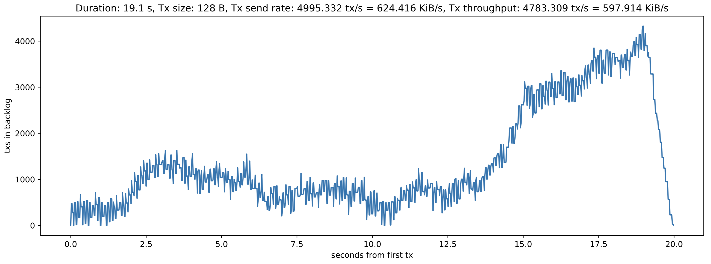

#### 4-node local t2.micro
Local datacenter (EU) 4-node t2.micro run gives throughput of `1170 tx/s`. As mentioned in the highlights section, latency in 4-node and 16-node tests is usually up to 2 seconds in average and may degrade to 3-5 second on rates close to maximal throughput. The monotonous graph growth on the image below corresponds to 20-second transaction broadcast, immediate falls correspond to block commits and post-20-second constant 'platos' correspond to backlog 'recovery' after over-saturated workflow (here it slightly over-saturated, comparing *throughput* and *rate* values).
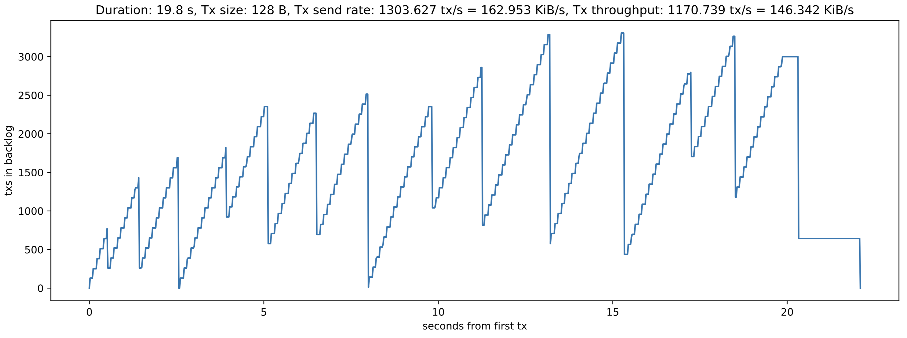

#### 4-node mixed t2.micro
During the next test one EU node change by a node from SA (South America datacenter) of the same type. The result is even better (`1229 tx/s`), but this can be explained by some undeterminism. The absence of degradation may be also explaned by the fact that the block consensus reached when the fastest 3 of 4 nodes commit blocks.
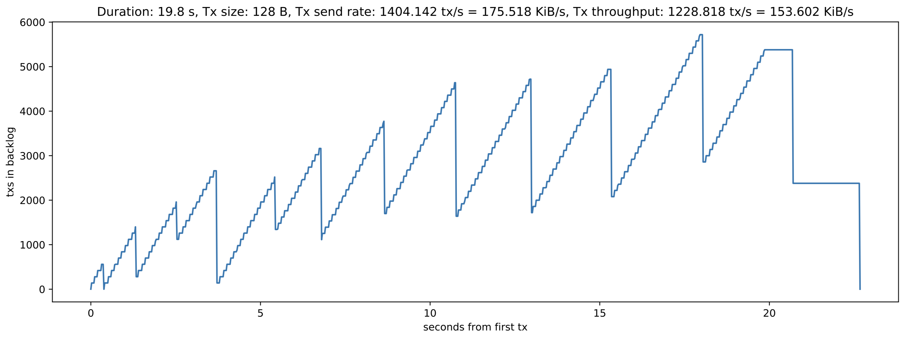

#### 4-node mixed t2.micro with 1 off
On the next test network topology is unchanged but 1 EU node is turn off forcibly. Here we can observe the degradation to `877 tx/s`: to reach the consensus two living EU nodes need to wait for SA node.
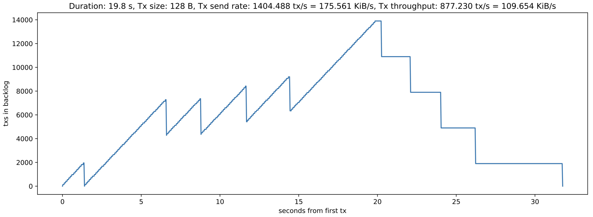

#### 4-node geo-distributed t2.micro
A cluster configuration with 4 working nodes from different datacenters (EU, SA, US and Asic Pacific) gives throughput value of `1125 tx/s`.
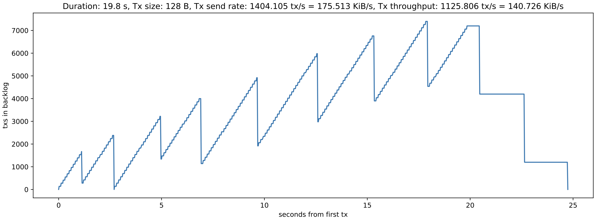

#### 16-node geo-distributed t2.micro
When we move from 4-node to 16-node geo-distributed cluster (4 datacenters with 4 node in each one) throughput decreases to `643 tx/s`.
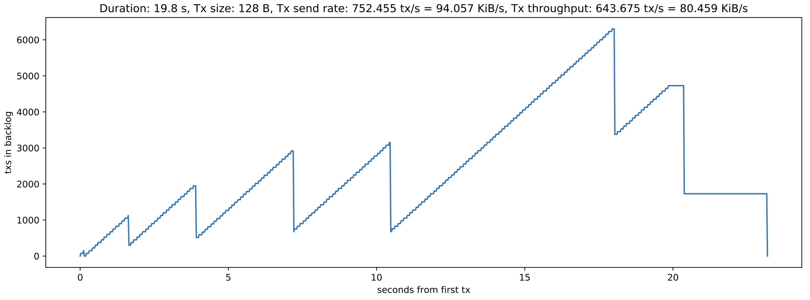

#### 16-node geo-distributed t2.medium
Next, let's observe performance boost when moving from t2.micro to t2.medium: `758 tx/s`.
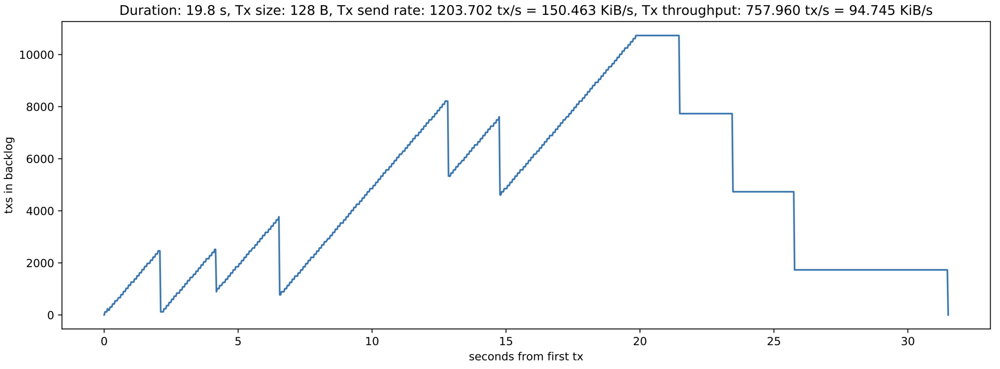

#### 40-node EU+US t2.medium
40-node 2-datacenter cluster gives `264 tx/s`. Network delays becomes more important and much more metadata needed to reach consensus.
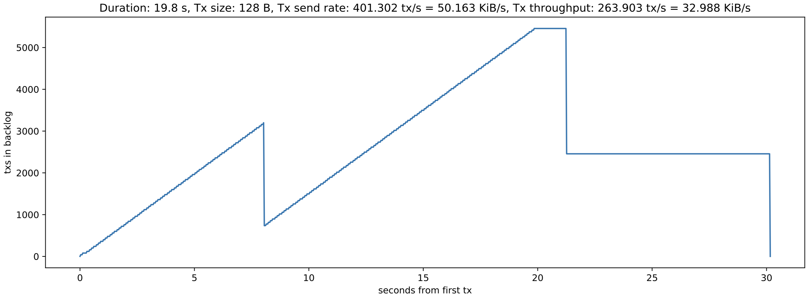

#### 79-node geo-distributed t2.medium
Increasing the number of nodes to 79 significantly reduced the performance. One the most stable runs gives `90 tx/s`.
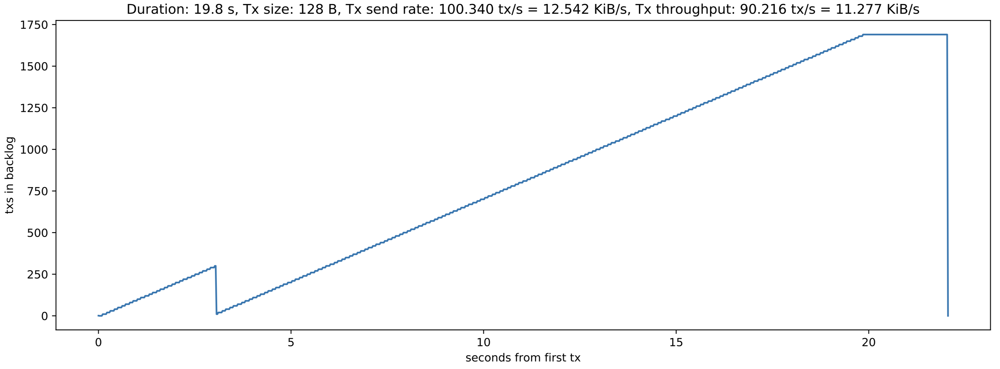

Overview

| Instance type | Total nodes | Failed nodes | Configuration | Peak throughput (per second) |
| --- | --- | --- | --- | --- |
| t2.micro | 4 | 0 | 3EU + 1SA | 1229 = 154kB |
| t2.micro | 4 | 0 | 4EU | 1170 = 146kB |
| t2.micro | 4 | 0 | 1EU+1SA+1US+1AP | 1126 = 141kB |
| t2.micro | 4 | 1 | 4EU | 1000 = 125kB |
| t2.micro | 4 | 1EU | 3EU+1SA | 877 = 110kB |
| t2.micro | 4 | 1 | 1EU+1SA+1US+1AP | 815 = 100kB |
| t2.micro | 16 | 0 | 4EU+4SA+4US+4AP | 643 = 80kB |
| t2.micro | 16 | 3 | 4EU+4SA+4US+4AP | 528 = 66kB |
| t2.medium | 4 | 0 | 4EU | 1300 = 160kB |
| t2.medium | 16 | 0 | 16EU | 880 = 110kB |
| t2.medium | 16 | 0 | 4EU+4SA+4US+4AP | 758 = 95kB |
| t2.medium | 40 | 0 | 20EU+20US | 264 = 33kB |
| t2.medium | 79 | 0 | 20EU+19SA+20US+20AP | 90 = 11kB |

### Transaction size tests
A series of tests with varying transaction size (from 64 B to 4 kB) was made. All of them used 4-node t2.micro single datacenter cluster (like 2nd line test from above table). The transaction througput decreases as expected while transaction size grows, byte throughput increases however with peak value of `173 kB/s` for 4 kB transactions.
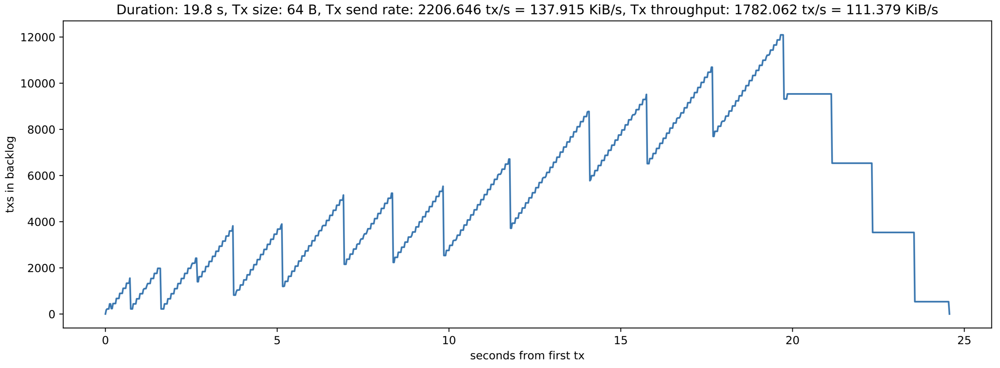
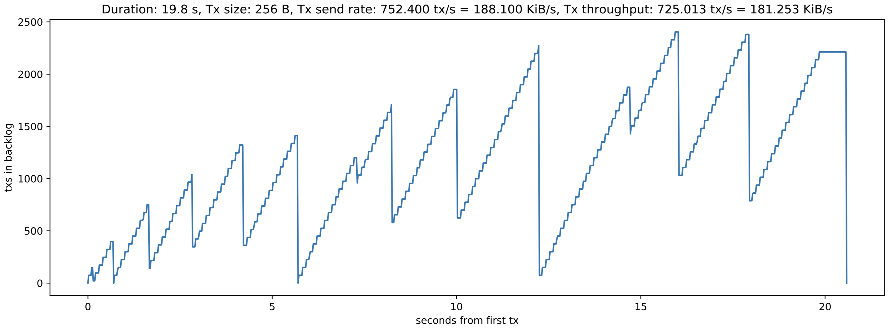
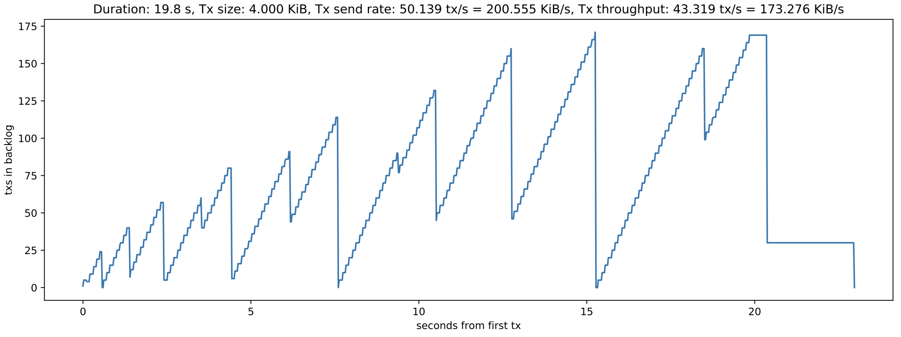

Overview

| Transaction size | tx/s | kB/s |
| --- | --- | --- |
| 64 | 1782 | 111 |
| 128 | 1170 | 146 |
| 256 | 725 | 181 |
| 1024 | 169 | 169 |
| 4096 | 173 | 173 |

### Maximum transactions per block tests
TODO
